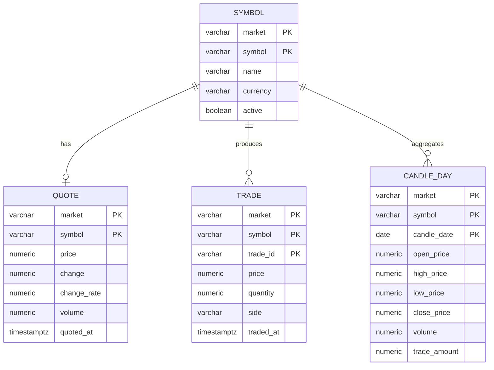

# ERD

```mermaid
erDiagram
    SYMBOL ||--o| QUOTE : has
    SYMBOL ||--o{ TRADE : produces
    SYMBOL ||--o{ CANDLE_DAY : aggregates

    SYMBOL {
      varchar market PK
      varchar symbol PK
      varchar name
      varchar currency
      boolean active
    }

    QUOTE {
      varchar market PK
      varchar symbol PK
      numeric price
      numeric change
      numeric change_rate
      numeric volume
      timestamptz quoted_at
    }

    TRADE {
      varchar market PK
      varchar symbol PK
      varchar trade_id PK
      numeric price
      numeric quantity
      varchar side
      timestamptz traded_at
    }

    CANDLE_DAY {
      varchar market PK
      varchar symbol PK
      date candle_date PK
      numeric open_price
      numeric high_price
      numeric low_price
      numeric close_price
      numeric volume
      numeric trade_amount
    }
```
