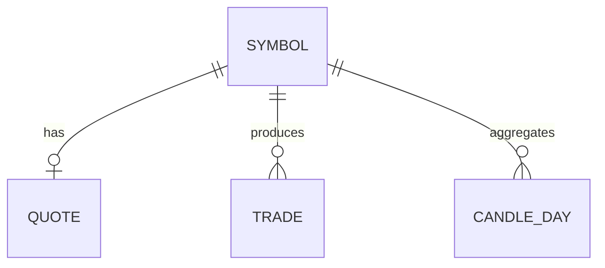

# DB 관리 매뉴얼

**데이터베이스**는 시세·주문·설정 등을 저장하는 **창고**입니다.  
이 제품은 **PostgreSQL** 을 쓰며, Docker로 DB를 띄우지 않습니다.

---

## 목차 (관리 순서)

1. [연결이 되는지 확인](#1-연결이-되는지-확인)
2. [창고 안 구역(스키마)과 표(테이블)](#2-창고-안-구역스키마과-표테이블)
3. [표끼리의 관계(ERD)](#3-표끼리의-관계erd)
4. [표 구조 바꾸기(마이그레이션)·빠른 찾기(인덱스)](#4-표-구조-바꾸기마이그레이션빠른-찾기인덱스)
5. [절대 하지 말 것](#5-절대-하지-말-것)

---

## 용어 설명

| 쉬운 말 | 전문 용어 | 뜻 |
|---------|-----------|-----|
| 창고 | Database (DB) | 데이터가 모인 곳 |
| 구역 | Schema | 표를 모아 둔 폴더 같은 개념 (`market`, `trading` …) |
| 표 | Table | 행·열로 된 저장 단위 |
| 칸 | Column | 표의 한 열 |
| 빠른 찾기 | Index | 검색을 빠르게 하는 목차 |
| 구조 변경 | Migration (Alembic) | 표를 안전하게 추가·수정하는 절차 |
| 그림으로 본 관계 | ERD | 표와 표가 어떻게 연결되는지 그린 도식 |

---

## 1. 연결이 되는지 확인

설정 파일의 다음 값이 맞아야 합니다.

- `DB_HOST`, `DB_PORT`, `DB_NAME`, `DB_USER`, `DB_PASSWORD`

연결 시험:

```powershell
.\.venv\Scripts\python.exe scripts\test_db_connection.py
```

서버 건강 점검에서도 확인:  
http://127.0.0.1:8000/health → `components.database`

**[스크린샷]** DB 연결 테스트 성공  
**[스크린샷]** `/health` 에서 database 정상

---

## 2. 창고 안 구역(스키마)과 표(테이블)

아래는 **실제 DB에 있는** 구역·표입니다. (조사 시점 기준 약 60개 표)

### `ai` — AI 결과 (3)

| 표 이름 | 쉬운 설명 |
|---------|-----------|
| `candidate_analysis_result` | 후보 종목 AI 분석 결과 |
| `candidate_analysis_run` | AI 분석을 한 번 돌린 기록 |
| `strategy_selection_run` | 전략을 고른 기록 |

### `backtest` — 과거 시험 (3)

| 표 이름 | 쉬운 설명 |
|---------|-----------|
| `backtest_run` | 백테스트 한 번 |
| `backtest_trade` | 그 안의 거래 |
| `backtest_equity` | 자산 곡선 |

### `disclosure` — 공시 (2)

| 표 이름 | 쉬운 설명 |
|---------|-----------|
| `dart_corp` | 공시 회사 |
| `dart_disclosure` | 공시 내용 |

### `market` — 시장 데이터 (7)

| 표 이름 | 쉬운 설명 |
|---------|-----------|
| `instrument` | 종목(상품) 목록 |
| `price_daily` | 일봉 가격 |
| `candle_minute` | 분봉 |
| `indicator_daily` | 일별 지표 |
| `quote_snapshot` | 호가·시세 스냅샷 |
| `trade_tick` | 체결 틱 |
| `orderbook_snapshot` | 호가창 스냅샷 |

### `news` — 뉴스 (3)

| 표 이름 | 쉬운 설명 |
|---------|-----------|
| `news_article` | 뉴스 원문 |
| `news_summary` | 요약 |
| `collection_failure` | 수집 실패 기록 |

### `operation` — 운영·안전 (16)

감사, 킬스위치, 실전 전환, 작업 이력, 달력 등  
예: `audit_event`, `kill_switch`, `live_trading_transition`, `job_run_history`, `alembic_version` …

### `strategy` — 전략·후보 (4)

| 표 이름 | 쉬운 설명 |
|---------|-----------|
| `candidate_run` / `candidate_result` | 후보 선별 실행·결과 |
| `position_plan` | 포지션(비중) 계획 |
| `risk_policy` | 위험 규칙 |

### `trading` — 주문·체결·모의·전략 배포 (22)

주문(`trading_order`), 체결(`execution`), 대기열(`order_outbox`),  
모의(`paper_*`), 브로커 스냅샷, 전략 배포·성과 등

> 각 칸(컬럼)의 자세한 이름까지는 이 문서에 다 적지 않습니다.  
> 추측하지 말고, DB 도구에서 표를 직접 확인하세요.

규칙 문서: [../database/DB_DEVELOPMENT_RULES.md](../database/DB_DEVELOPMENT_RULES.md)  
예전 객체: [../database/LEGACY_DB_OBJECTS.md](../database/LEGACY_DB_OBJECTS.md)

---

## 3. 표끼리의 관계(ERD)

시장 심볼 중심 샘플 그림: [../database/ERD.md](../database/ERD.md)



60개 표를 한 장에 다 그린 고정 ERD는 없습니다.  
표 관계는 마이그레이션·코드 모델을 기준으로 확인합니다.

**[스크린샷]** (선택) DB 도구에서 스키마 목록이 보이는 화면

---

## 4. 표 구조 바꾸기(마이그레이션)·빠른 찾기(인덱스)

### 마이그레이션 (Alembic)

| 항목 | 내용 |
|------|------|
| 설정 파일 | `alembic.ini` |
| 스크립트 위치 | `database/alembic/versions/` |
| 최신으로 맞추기 | `python -m alembic upgrade head` |
| 확인 | `.\scripts\verify_alembic.ps1` |

자세한 검증: [../database/ALEMBIC_VERIFY.md](../database/ALEMBIC_VERIFY.md)

> `docs/migration-overlays` 안의 파일은 **참고용**입니다. 실행하지 마세요.

**[스크린샷]** `alembic current` / `heads` 출력

### 인덱스(빠른 찾기) 목록 보기

```sql
SELECT schemaname, tablename, indexname
FROM pg_indexes
WHERE schemaname NOT IN ('pg_catalog', 'information_schema')
ORDER BY 1, 2, 3;
```

---

## 5. 절대 하지 말 것

1. 백업 없이 표 삭제(`drop`)·비우기(`truncate`)  
2. Alembic이 “머리가 둘(multiple heads)”인 채로 무작정 upgrade  
3. DB 버전과 코드 버전이 어긋난 채 실전 주문  
4. 비밀 설정 파일을 Git에 올리기  

백업·복구: [백업복구매뉴얼.md](백업복구매뉴얼.md)
