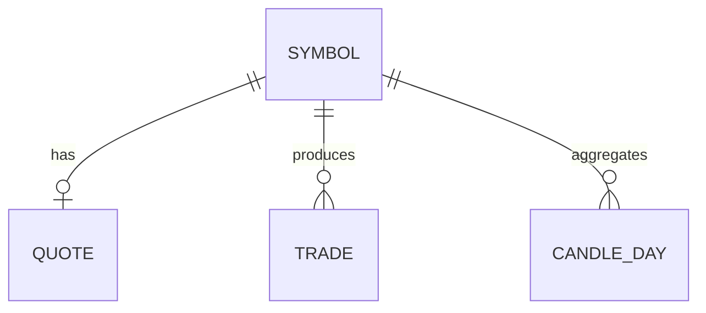

# DB 관리 매뉴얼

PostgreSQL 기준. Docker DB 컨테이너는 사용하지 않습니다.

## 목차

1. [연결](#연결)
2. [Schema·Table](#schematable)
3. [관계·ERD](#관계erd)
4. [Index·Migration](#indexmigration)
5. [운영 주의](#운영-주의)

---

## 연결

환경변수: `DB_HOST`, `DB_PORT`, `DB_NAME`, `DB_USER`, `DB_PASSWORD`

```powershell
.\.venv\Scripts\python.exe scripts\test_db_connection.py
```

Health: `GET /health` → `components.database`

---

## Schema·Table

실제 DB에 존재하는 스키마·테이블 (조사 시점 기준, 60 tables):

### `ai` (3)

| Table | 용도(이름 기준) |
|-------|-----------------|
| `candidate_analysis_result` | AI 후보 분석 결과 |
| `candidate_analysis_run` | AI 분석 실행 |
| `strategy_selection_run` | 전략 선택 실행 |

### `backtest` (3)

| Table |
|-------|
| `backtest_run` |
| `backtest_trade` |
| `backtest_equity` |

### `disclosure` (2)

| Table |
|-------|
| `dart_corp` |
| `dart_disclosure` |

### `market` (7)

| Table |
|-------|
| `instrument` |
| `price_daily` |
| `candle_minute` |
| `indicator_daily` |
| `quote_snapshot` |
| `trade_tick` |
| `orderbook_snapshot` |

### `news` (3)

| Table |
|-------|
| `news_article` |
| `news_summary` |
| `collection_failure` |

### `operation` (16)

| Table |
|-------|
| `alembic_version` |
| `audit_event` |
| `broker_recovery_run` / `broker_recovery_step` |
| `daily_operations_report` |
| `idempotency_key` |
| `job_run_history` |
| `kill_switch` / `kill_switch_history` |
| `live_trading_transition` |
| `pipeline_run` / `pipeline_step_run` |
| `position_limit` |
| `risk_event` |
| `system_health` |
| `trading_calendar_day` |

### `strategy` (4)

| Table |
|-------|
| `candidate_run` / `candidate_result` |
| `position_plan` |
| `risk_policy` |

### `trading` (22)

주문·체결·페이퍼·전략 배포·리더보드·성과 등:

`trading_order`, `trading_order_status_history`, `execution`, `order_outbox`,  
`paper_account`, `paper_order`, `paper_position`, `paper_trade`,  
`broker_account_snapshot`, `broker_position_snapshot`, `broker_pending_order`,  
`strategy_deployment*`, `strategy_runtime_switch`, `strategy_approval_run`,  
`strategy_leaderboard_*`, `strategy_performance_*`, `walk_forward_window_metric` 등

> 컬럼·PK/FK 상세는 `\d schema.table` 또는 MCP/`information_schema`로 확인합니다.  
> 문서에 없는 컬럼을 추측하지 않습니다.

규칙: [../database/DB_DEVELOPMENT_RULES.md](../database/DB_DEVELOPMENT_RULES.md)  
Legacy: [../database/LEGACY_DB_OBJECTS.md](../database/LEGACY_DB_OBJECTS.md)

---

## 관계·ERD

문서화된 ERD 샘플(시장 심볼 중심): [../database/ERD.md](../database/ERD.md)



전체 60테이블 ERD는 단일 다이어그램으로 고정되어 있지 않습니다.  
스키마별 관계는 마이그레이션·ORM 모델을 기준으로 확인합니다.

---

## Index·Migration

### Migration (Alembic)

| 항목 | 값 |
|------|-----|
| 설정 | `alembic.ini` → `script_location = database/alembic` |
| 버전 디렉터리 | `database/alembic/versions/` |
| 적용 | `python -m alembic upgrade head` |
| 검증 | `.\scripts\verify_alembic.ps1` · [../database/ALEMBIC_VERIFY.md](../database/ALEMBIC_VERIFY.md) |

**주의:** `docs/migration-overlays/*.py`는 참고용이며 **Alembic 실행 대상이 아닙니다.**

### Index

인덱스 정의는 각 Alembic revision에 있습니다.  
DB에서 확인:

```sql
SELECT schemaname, tablename, indexname
FROM pg_indexes
WHERE schemaname NOT IN ('pg_catalog', 'information_schema')
ORDER BY 1, 2, 3;
```

---

## 운영 주의

1. 프로덕션에서 `drop`/`truncate` 금지 (백업 후 작업)  
2. multiple heads 발생 시 upgrade 전 chain 정리  
3. `operation.alembic_version`과 `alembic heads` 일치 확인  
4. 백업: [백업복구매뉴얼.md](백업복구매뉴얼.md)
